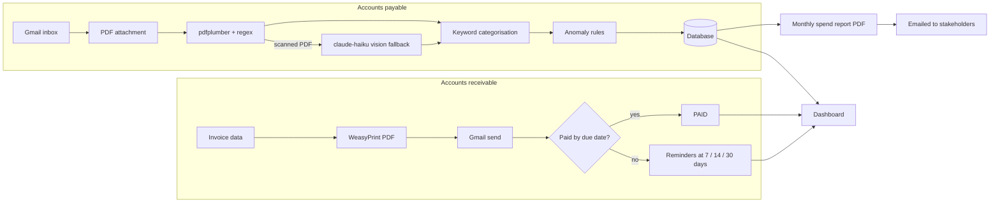

# Trinops Accounting

Two-sided accounting automation for SMEs: **accounts receivable** (generate, send and chase
outbound invoices) and **accounts payable** (read supplier invoices straight out of the inbox).

## The problem

SMEs waste hours on two sides of the same coin:

- **AR** - creating invoices by hand, forgetting who has paid, and writing awkward chaser
  emails when they haven't.
- **AP** - supplier invoices arrive as PDF attachments, then someone retypes the vendor,
  amount and date into a spreadsheet.

This service automates both. Invoices go out branded, on time, and chase themselves.
Incoming supplier invoices are parsed, categorised and anomaly-checked without anyone
opening the email.

## How it works



**Rules first, AI last.** Field extraction is pdfplumber + regex; categorisation is keyword
rules; anomaly detection is arithmetic. The only AI call in the system is a
`claude-haiku-4-5-20251001` vision fallback for scanned PDFs that contain no extractable
text - and it is optional (leave `ANTHROPIC_API_KEY` empty to disable it).

### AR - outbound invoices

- Branded PDF invoices generated from client/job data (WeasyPrint + Jinja2)
- Sent via Gmail on demand, tracked through `DRAFT → SENT → OVERDUE → PAID`
- Escalating reminder emails at configurable intervals (default 7, 14, 30 days overdue),
  each logged so a client is never chased twice for the same threshold

### AP - inbound supplier invoices

- Gmail inbox monitored for PDF attachments on a schedule
- `pdfplumber` + regex extracts vendor, invoice number, amounts and date - no API call
- Spend auto-categorised by keyword rules (Travel, Materials, Software, ...)
- Anomalies flagged by arithmetic rules: possible duplicates, missing VAT, VAT that does
  not match the configured rate, out-of-range dates
- Monthly spend summary PDF generated and emailed to stakeholders automatically

### Dashboard

Single-page admin view (vanilla JS + Chart.js): AR invoice table with status badges and
send/mark-paid actions, AP expense table with anomaly flags, category overrides and a
review queue, plus monthly spend and AR status charts.

## Quick start (demo mode)

No Google account, no API key, no setup beyond Docker:

```bash
docker compose up --build
```

Then open <http://localhost:8000>. Demo mode:

- seeds six outbound invoices (drafts, current, overdue and paid)
- renders seven seed supplier invoices to real PDFs and runs them through the actual
  pdfplumber parsing pipeline - including a missing-VAT case, a duplicate pair, a VAT
  mismatch and a future-dated invoice, all visible as flags in the dashboard
- writes every outbound email (invoices, reminders, reports) to `data/outbox/` as HTML
  files instead of sending anything

Generated artefacts land in `data/`: AR invoice PDFs in `data/invoices/`, parsed supplier
PDFs in `data/inbound/`, monthly reports in `data/reports/`.

## Running tests

```bash
python -m venv .venv && source .venv/bin/activate
pip install -r requirements.txt
pytest
```

WeasyPrint needs native libraries (Pango). On macOS: `brew install pango`. On Debian/Ubuntu
they are in the Dockerfile already.

## Going live

1. Copy `.env.example` to `.env` and set `DEMO_MODE=false`
2. Create a Google Cloud project, enable the Gmail API, download OAuth credentials as
   `credentials.json`, and complete the OAuth flow to produce `token.json`
3. Set company details, VAT rate, payment terms and reminder thresholds in `.env`
4. Optionally set `ANTHROPIC_API_KEY` to enable the scanned-PDF vision fallback
5. Swap SQLite for PostgreSQL by changing `DATABASE_URL` - the models are SQLAlchemy 2.0
   and carry over unchanged

## API

| Method | Path | Purpose |
|---|---|---|
| GET | `/invoices?status=` | List AR invoices |
| POST | `/invoices` | Create a draft invoice |
| POST | `/invoices/{id}/send` | Generate PDF + email it (DRAFT only) |
| PATCH | `/invoices/{id}/paid` | Mark SENT/OVERDUE invoice paid |
| GET | `/expenses?anomalies_only=&category=` | List AP expenses |
| GET | `/expenses/summary` | Monthly spend by category (chart data) |
| PATCH | `/expenses/{id}/category` | Override a category |
| PATCH | `/expenses/{id}/clear-anomaly` | Clear an anomaly flag after review |
| POST | `/reports/monthly?year=&month=` | Generate + email the spend summary |

Interactive docs at <http://localhost:8000/docs>.

## Project structure

```
accounting/
  ar/                    # invoice generation, sending, reminders
  ap/                    # inbox watcher, parser, categoriser, anomaly rules
  reports/               # monthly spend summary
  scheduler.py           # APScheduler: inbox poll, reminder check, monthly report
  models.py              # OutboundInvoice, ReminderLog, InboundInvoice
api/                     # FastAPI app + routes
frontend/                # dashboard (vanilla JS + Chart.js)
templates/               # Jinja2: invoice, emails, supplier demo, report
seed/                    # demo data (Client X / Supplier Y style, nothing real)
tests/                   # pytest suite for parser, categoriser, anomalies, reminders
```

## Tech stack

FastAPI · SQLAlchemy 2.0 · SQLite (PostgreSQL-ready) · Gmail API · pdfplumber ·
Claude API (haiku, vision fallback only) · WeasyPrint · Jinja2 · APScheduler ·
Chart.js · pytest · Docker
